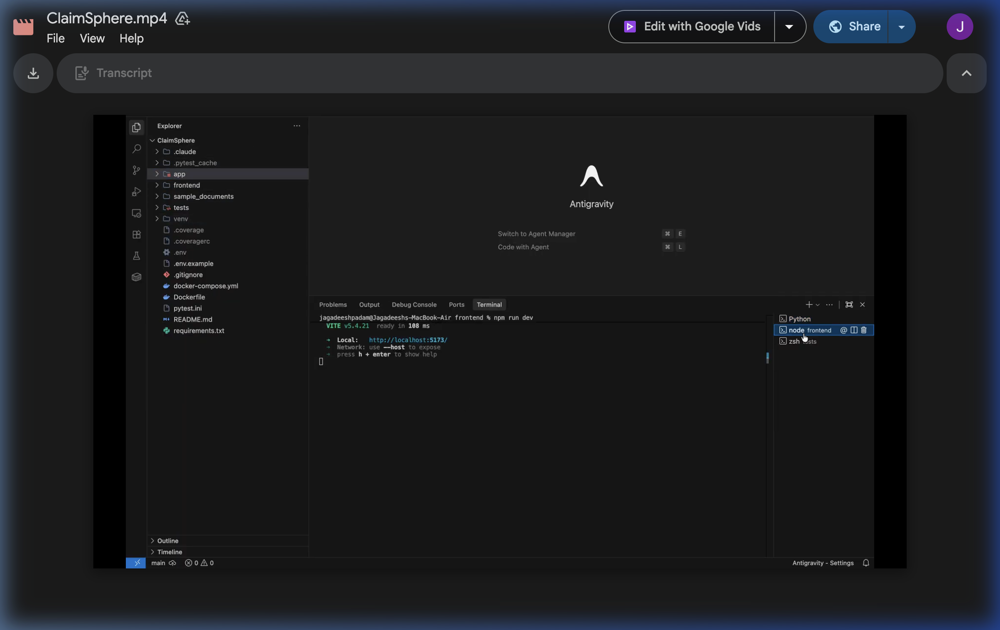

# FNOLAgent — Autonomous Insurance Claims Processing Agent

> AI-powered FNOL document processing system that extracts structured claim data, validates mandatory fields, classifies claims, and routes them automatically using Azure OpenAI GPT-4.1 with Structured Outputs.

## Demo

[](docs/demo/demo.mp4)

> Click the image above to play the demo video.

---

## Overview

FNOLAgent is a production-ready, full-stack insurance claims processing platform. Insurance adjusters upload First Notice of Loss (FNOL) documents (PDF or TXT), and the system:

1. Parses the document (pdfplumber → PyPDF2 → OCR fallback for scanned PDFs)
2. Extracts 16 structured fields using Azure OpenAI GPT-4.1 Structured Outputs
3. Validates mandatory fields and detects missing information
4. Routes the claim using a deterministic rule engine with strict priority ordering
5. Generates human-readable reasoning for each routing decision
6. Returns a complete JSON response displayed in a modern React dashboard

---

## Features

- **Drag-and-drop file upload** (PDF / TXT, up to 10 MB)
- **AI extraction** via Azure OpenAI GPT-4.1 with JSON schema enforcement
- **OCR support** for scanned PDFs (pytesseract + pdf2image)
- **Validation engine** — detects missing mandatory fields
- **Routing engine** — 5 routes with strict priority ordering
- **Reasoning engine** — plain-English routing explanations
- **Modern React UI** with dark mode, colored route badges, upload history
- **Copy / Download JSON** response
- **Swagger & ReDoc** API documentation
- **Complete test suite** (unit + integration, 80%+ coverage target)
- **Docker Compose** deployment

---

## Tech Stack

| Layer | Technology |
|---|---|
| Backend | Python 3.11, FastAPI, Uvicorn |
| AI / NLP | Azure OpenAI GPT-4.1, Structured Outputs |
| Document parsing | pdfplumber, PyPDF2, pytesseract, Pillow |
| Validation | Pydantic v2 |
| Frontend | React 18, Vite, Tailwind CSS |
| Testing | pytest, pytest-asyncio, httpx |
| Deployment | Docker, Docker Compose |

---

## Architecture

```
User Browser
     │
     ▼
React Frontend (Vite + Tailwind)
     │  POST /upload-claim (multipart)
     ▼
FastAPI Backend
     │
     ├── document_parser.py   ← pdfplumber / PyPDF2 / OCR
     ├── extraction_service.py ← Azure OpenAI structured outputs
     ├── validation_service.py ← mandatory field check
     ├── routing_service.py   ← deterministic rule engine
     └── reasoning_service.py ← human-readable explanation
```

### Routing Rule Priority

| Priority | Route | Trigger |
|---|---|---|
| 1 | Investigation Flag | Description contains "fraud", "inconsistent", or "staged" |
| 2 | Manual Review | Any mandatory field missing |
| 3 | Specialist Queue | Claim type == injury |
| 4 | Fast-track | Estimated damage < $25,000 |
| 5 | Standard Processing | Default |

---

## Folder Structure

```
FNOLAgent/
├── app/
│   ├── main.py
│   ├── routers/claim_router.py
│   ├── services/
│   │   ├── azure_openai_client.py
│   │   ├── document_parser.py
│   │   ├── extraction_service.py
│   │   ├── validation_service.py
│   │   ├── routing_service.py
│   │   └── reasoning_service.py
│   ├── models/
│   │   ├── claim_models.py
│   │   └── response_models.py
│   ├── prompts/extraction_prompt.py
│   ├── utils/{logger,helpers}.py
│   └── config/settings.py
├── frontend/
│   ├── src/
│   │   ├── components/
│   │   ├── services/claimApi.js
│   │   ├── pages/HomePage.jsx
│   │   ├── App.jsx
│   │   └── main.jsx
│   ├── package.json
│   └── vite.config.js
├── tests/
│   ├── conftest.py
│   ├── test_health.py
│   ├── test_upload_claim.py
│   ├── test_extraction_service.py
│   ├── test_validation_service.py
│   ├── test_routing_service.py
│   ├── test_reasoning_service.py
│   ├── test_azure_openai_client.py
│   └── sample_test_files/
├── sample_documents/
├── Dockerfile
├── docker-compose.yml
├── requirements.txt
├── pytest.ini
└── .env.example
```

---

## API Endpoints

### `GET /health`
Returns service health status.

**Response:**
```json
{
  "status": "healthy",
  "version": "1.0.0",
  "model": "gpt-4.1"
}
```

### `POST /upload-claim`
Upload an FNOL document for processing.

**Request:** `multipart/form-data` with field `file` (PDF or TXT)

**Response:**
```json
{
  "extractedFields": {
    "policyNumber": "POL-2024-789456",
    "policyholderName": "Jane Smith",
    "effectiveDates": "01/01/2024 - 12/31/2024",
    "incidentDate": "03/15/2024",
    "incidentTime": "14:30",
    "incidentLocation": "123 Main St, Springfield, IL",
    "incidentDescription": "Vehicle rear-ended at traffic light.",
    "claimantName": "Jane Smith",
    "thirdParties": ["John Doe"],
    "contactDetails": "jane.smith@email.com | (555) 123-4567",
    "assetType": "Automobile",
    "assetId": "VIN: 1HGCM82633A123456",
    "estimatedDamage": "$8,500",
    "claimType": "auto",
    "attachments": ["police_report.pdf", "photos.zip"],
    "initialEstimate": "$8,500"
  },
  "missingFields": [],
  "recommendedRoute": "Fast-track",
  "reasoning": "Claim routed to Fast-track because the estimated damage ($8,500.00) is below the $25,000 threshold."
}
```

**Error Codes:**

| Code | Meaning |
|---|---|
| 400 | Empty file |
| 413 | File too large (> 10 MB) |
| 415 | Unsupported file type |
| 422 | Unprocessable document content |
| 500 | Internal server error |

---

## Azure OpenAI Setup

1. Create an Azure OpenAI resource in the Azure Portal
2. Deploy **GPT-4.1** as a deployment named `gpt-4.1`
3. Copy the **Endpoint** and **API Key** from the resource's "Keys and Endpoint" page
4. Set the environment variables (see below)

The system uses the **Structured Outputs** feature (`beta.chat.completions.parse`) to enforce a strict JSON schema, eliminating hallucinated field names.

---

## Environment Variables

| Variable | Description |
|---|---|
| `AZURE_OPENAI_ENDPOINT` | Azure OpenAI resource endpoint URL |
| `AZURE_OPENAI_API_KEY` | Azure OpenAI API key |
| `OPENAI_STRUCTURED_OUTPUT_MODEL` | Deployment name (default: `gpt-4.1`) |
| `AZURE_OPENAI_API_VERSION` | API version (default: `2024-12-01-preview`) |

---

## Error Handling

- **File validation** — type, size, and empty-file checks before any processing
- **Document parsing** — pdfplumber → PyPDF2 → OCR cascade with graceful fallback at each stage
- **AI extraction** — JSON decode errors return empty `ExtractedFields` (no crash)
- **OpenAI retries** — tenacity retries up to 3× with exponential back-off
- **HTTP errors** — FastAPI exception handlers return structured JSON error responses
- **Frontend** — per-field error display, upload failure alerts, file type validation

---

## Assumptions

- Uploaded documents are genuine FNOL reports in English
- The Azure OpenAI deployment is named `gpt-4.1`; change `OPENAI_STRUCTURED_OUTPUT_MODEL` if different
- OCR (`pytesseract`) requires `tesseract-ocr` binary installed on the host (included in the Docker image)
- `pdf2image` is optional — if not installed, OCR falls back to text extraction only
- Monetary values in documents are in USD

---

## Future Improvements

- PostgreSQL persistence layer for claim records
- JWT-based authentication and role-based access control
- Webhook notifications on routing decisions
- Batch processing API endpoint
- Multi-language FNOL document support
- Confidence scores per extracted field
- Audit trail with versioned routing decisions

---

# How to Run

## 1. Clone Repository

```bash
git clone https://github.com/your-username/FNOLAgent.git
cd FNOLAgent
```

## 2. Backend Setup

```bash
python -m venv venv

# Windows
venv\Scripts\activate

# Mac / Linux
source venv/bin/activate

pip install -r requirements.txt
```

## 3. Configure Environment Variables

Create `.env` file (copy from `.env.example`):

```
AZURE_OPENAI_ENDPOINT=https://your-resource.openai.azure.com/
AZURE_OPENAI_API_KEY=your_key_here
OPENAI_STRUCTURED_OUTPUT_MODEL=gpt-4.1
AZURE_OPENAI_API_VERSION=2024-12-01-preview
```

## 4. Run Backend

```bash
uvicorn app.main:app --reload
```

- Backend URL: http://127.0.0.1:8000
- Swagger Docs: http://127.0.0.1:8000/docs
- ReDoc: http://127.0.0.1:8000/redoc

## 5. Frontend Setup

```bash
cd frontend
npm install
npm run dev
```

- Frontend URL: http://localhost:5173

## 6. Run Tests

```bash
# All tests
pytest

# With coverage report
pytest --cov=app tests/

# HTML coverage report
pytest --cov=app --cov-report=html tests/
```

## 7. Docker (full stack)

```bash
docker-compose up --build
```

- Frontend: http://localhost:5173
- Backend API: http://localhost:8000
- Swagger: http://localhost:8000/docs
# FNOLAgent
# FNOLAgent
